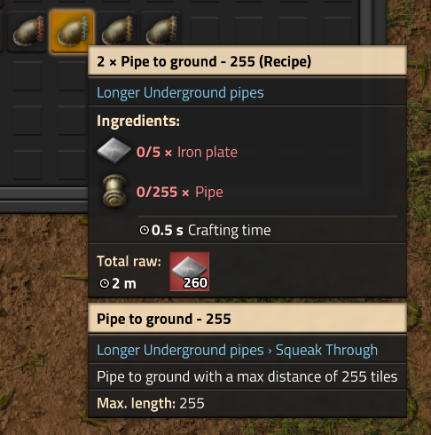

# Longer UPipes

This is a minimal [Factorio](https://factorio.com/) mod that adds a few pipe connectors that will connect to more than the default 10 tile distance.

Adds 50, 100, and 255 underground tile connections. This also scales crafting according to the vanilla recipe. For example, vanilla has 10 pipes for 10 underground tiles by default, in this mod, for 50 tiles underground you need 50 pipes.

